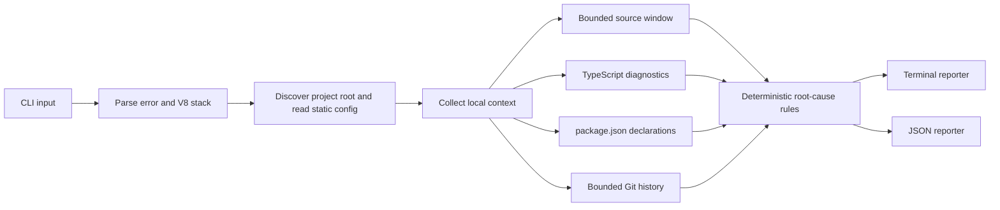

# DebugLens

[](https://github.com/NourMoftah/DebugLens-/actions/workflows/ci.yml)

**A local-first CLI that turns JavaScript and TypeScript error text into deterministic, evidence-backed diagnostic reports.**

## What is DebugLens?

DebugLens is an open-source Node.js CLI and reusable TypeScript core for investigating local JavaScript and TypeScript failures. Given a V8/Node-style error stack—or a focused file and line—it parses the diagnostic, collects bounded project-local context, and reports a conservative root-cause hypothesis with the evidence that led to it.

It is intentionally deterministic: DebugLens does not call an AI service, send telemetry, modify source code, or execute project configuration.

## The problem it solves

An error message often identifies a symptom but leaves the surrounding evidence scattered across a stack trace, source file, `tsconfig.json`, `package.json`, and recent Git history. DebugLens gathers the relevant local signals into one report so a developer can start investigation from a concrete location and a small, explicit set of observations.

## Key features

- Parses common V8/Node error headings and stack frames, including Windows paths, async frames, internal Node frames, and native frames.
- Locates the first non-internal stack location and reads a bounded source window around it.
- Collects local TypeScript compiler diagnostics when a root `tsconfig.json` is present.
- Reads declared dependency metadata from `package.json`; it does not install or resolve packages.
- Reads bounded local Git context using fixed Git arguments.
- Applies deterministic rules for matching TypeScript diagnostics, missing dependencies, unsafe null/undefined property access, repeated application frames, and recent changes to the surfaced file.
- Provides readable terminal output or stable, ANSI-free JSON.
- Supports project discovery, focused file-and-line analysis, validated static configuration, CI mode, and project watch mode.

## Architecture overview



The reusable implementation lives in `@debuglens/core`; `@debuglens/cli` owns command parsing, project discovery, configuration, watch lifecycle, and reporting. See the [architecture notes](docs/architecture.md) for the repository’s technical outline.

## How it works

1. The CLI accepts exactly one input: `--error`, `--error-file`, or `--file` together with `--line`.
2. It finds the nearest directory containing `debuglens.config.ts`, `package.json`, or `tsconfig.json`.
3. It normalizes a V8-style error and selects a primary stack location, preferring a non-internal frame.
4. For a location, it gathers source lines, local TypeScript diagnostics, and declared package metadata; it also gathers Git context unless disabled.
5. Rules rank supported evidence deterministically and emit a root-cause kind, confidence, evidence, and suggested next action.
6. The report is rendered to the terminal or serialized as JSON.

## Project structure

```text
apps/cli/                CLI commands, configuration, watch mode, reporters
packages/core/           Parsing, local context, Git context, root-cause rules
examples/                Minimal JavaScript, TypeScript, and dependency scenarios
docs/                    Architecture documentation
tests/                   Reserved for future cross-package integration tests
.github/workflows/ci.yml CI verification workflow
```

## Requirements

- Node.js `>=20.10.0`
- pnpm `>=10.0.0` (the repository pins `pnpm@10.33.4`)
- Git is optional: analysis still runs without it, but Git context is reported as unavailable.

## Installation

DebugLens is currently a private workspace package, so install it from source rather than from the npm registry:

```bash
git clone https://github.com/NourMoftah/DebugLens-.git
cd DebugLens-
pnpm install --frozen-lockfile
pnpm build
```

Run the workspace CLI with `pnpm exec`:

```bash
pnpm exec debuglens --version
pnpm exec debuglens --help
```

## Development setup

```bash
git clone https://github.com/NourMoftah/DebugLens-.git
cd DebugLens-
pnpm install
pnpm build
```

`pnpm dev` rebuilds the packages and runs the local CLI. The core package is exposed as `@debuglens/core` within the workspace.

### Optional project configuration

Place `debuglens.config.ts` at the project root. It must have a static `export default` object—DebugLens parses literal values only and never executes the file.

```ts
export default {
  maxSourceContext: 3,
  git: true,
  typescript: true,
  dependencies: true,
  ignoredDirectories: ['node_modules', 'dist'],
  reporter: 'terminal',
  watch: { debounceMs: 250 },
};
```

Defaults: five source-context lines on each side, Git/TypeScript/dependency collection enabled, terminal reporting, and a 250 ms watch debounce. `maxSourceContext` accepts integers from 0 to 100; `watch.debounceMs` accepts integers from 0 to 10,000.

## Build

```bash
pnpm build
```

This builds `@debuglens/core` first and then `@debuglens/cli`.

## Testing

```bash
pnpm test
```

The Vitest suite covers parser behavior, safe source and project context collection, Git context, deterministic root-cause rules, CLI validation, configuration, watch lifecycle, and both reporters.

## Typecheck, lint, and format

```bash
pnpm typecheck
pnpm lint
pnpm format:check
```

Use `pnpm format` to apply Prettier formatting.

## CLI usage

### Analyze the included JavaScript example

[`examples/javascript-error/src/app.js`](examples/javascript-error/src/app.js) contains an undefined value followed by `.map()`:

```bash
pnpm exec debuglens analyze \
  --project examples/javascript-error \
  --error "TypeError: Cannot read properties of undefined (reading 'map')
    at main (src/app.js:2:7)" \
  --ci
```

### Focus the included TypeScript example

[`examples/typescript-error/src/app.ts`](examples/typescript-error/src/app.ts) has a TypeScript assignment error at line 1:

```bash
pnpm exec debuglens analyze \
  --project examples/typescript-error \
  --file src/app.ts \
  --line 1 \
  --json \
  --ci
```

### Analyze a project-local error file

`--error-file` is resolved relative to the selected project and must remain within that project:

```bash
pnpm exec debuglens analyze --project . --error-file error.log --json
```

### Watch a project

Watch mode accepts `--error` or `--error-file`, performs an initial analysis, then re-runs it after watched project changes. Stop it with <kbd>Ctrl</kbd>+<kbd>C</kbd>.

```bash
pnpm exec debuglens watch --project . --error-file error.log --ci
```

`--ci` disables terminal color. `--json` selects JSON output (and takes precedence over terminal formatting). Run `debuglens analyze --help` or `debuglens watch --help` for the accepted argument forms.

### Exit codes

| Code | Meaning                                                             |
| ---- | ------------------------------------------------------------------- |
| `0`  | Analysis completed with insufficient evidence for a probable cause. |
| `1`  | A probable cause was found.                                         |
| `2`  | Invalid command input.                                              |
| `3`  | Tooling failure, such as unsafe or unreadable input.                |

## Example diagnostic output

The JavaScript example above produces this terminal report (absolute source paths vary by machine):

```text
DebugLens Diagnostic Report

Error
  Type: TypeError
  Message: Cannot read properties of undefined (reading 'map')
  Location: src/app.js:2:7

Root Cause
  Probable cause: unsafe-property-access — A null or undefined value appears to be accessed at the surfaced source line.
  Confidence: medium

Evidence
  - Runtime error surfaced at src/app.js:2:7. (src/app.js:2:7)
  - The runtime message reports null or undefined access and the target source line performs property access. (src/app.js:2:7)

Suggestions
  - Verify the accessed value is present before reading its property.
```

## Supported diagnostics

DebugLens parses error headings that match `Error` or a JavaScript-style `*Error` name, and valid V8-style `at …` frames. It recognizes ordinary paths, Windows paths, async frames, Node internal frames, and native frames.

Its root-cause rules currently emit only these kinds:

| Kind                      | Triggering evidence                                                                                   | Confidence |
| ------------------------- | ----------------------------------------------------------------------------------------------------- | ---------- |
| `typescript-diagnostic`   | An error-level TypeScript diagnostic matches the primary file and line.                               | High       |
| `missing-dependency`      | `Cannot find module/package '…'` names a non-relative package absent from declared dependencies.      | High       |
| `unsafe-property-access`  | The error mentions `null` or `undefined` and the target source line contains property/bracket access. | Medium     |
| `recent-code-change`      | Recent Git history includes a changed file with the surfaced filename.                                | Low        |
| `runtime-source-location` | A primary runtime source location was parsed.                                                         | Low        |
| `insufficient-evidence`   | No rule produced a candidate.                                                                         | None       |

All collected evidence is retained in the report, even when a higher-priority rule selects the root-cause kind.

## Security considerations

- All source reads and `--error-file` reads are constrained to the selected project root; paths are checked again after symlink resolution.
- Source files over 5 MiB are not read, and source windows are limited to the requested range.
- `debuglens.config.ts` is parsed as a static object literal; no configuration code is executed.
- Git commands use fixed argument arrays with `shell: false`; Git history is limited to at most 100 commits (10 by default).
- Dependency context comes only from local `package.json` declarations. DebugLens does not fetch packages or send diagnostic data to a remote service.

As with any debugging tool, pasted errors and local source can contain sensitive information. Review generated output before sharing it outside your team.

## Performance considerations

- Source collection streams only the requested line window and refuses files larger than 5 MiB.
- TypeScript diagnostics are collected only when `tsconfig.json` exists at the selected project root.
- Git history is bounded to 10 commits by default and capped at 100.
- Watch mode recursively registers directory watchers while skipping configured ignored directory names; large projects may therefore need an appropriate `ignoredDirectories` configuration.

## Current limitations

- Supports common Node.js/V8 stack formats, not every JavaScript runtime or framework format.
- It uses conservative rules, not semantic AST/data-flow analysis.
- It does not apply fixes, alter code, integrate with an IDE, provide cloud services, use AI/LLM reasoning, or emit telemetry.
- TypeScript context requires a root-level `tsconfig.json`; dependency context describes declarations rather than installed-package resolution.
- Git evidence is local and filename-based when comparing changed files to a surfaced source file.
- Watch mode observes directories that exist when it starts; newly created directories are not added dynamically.

## Roadmap

The repository’s documented direction is to broaden runtime formats and add framework-specific plugins while keeping the local-first deterministic core. These are potential future directions, not currently implemented functionality:

- Additional JavaScript runtime stack formats.
- Framework-specific diagnostic plugins.
- More deterministic analysis rules while preserving the existing security boundaries.

## Contributing

Contributions are welcome. Please read [CONTRIBUTING.md](CONTRIBUTING.md), keep changes focused, add or update relevant tests, and run the full verification set before opening a pull request:

```bash
pnpm test
pnpm lint
pnpm typecheck
pnpm format:check
pnpm build
```

## License

DebugLens is released under the [MIT License](LICENSE).
